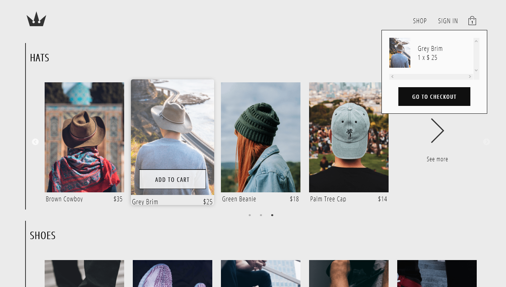
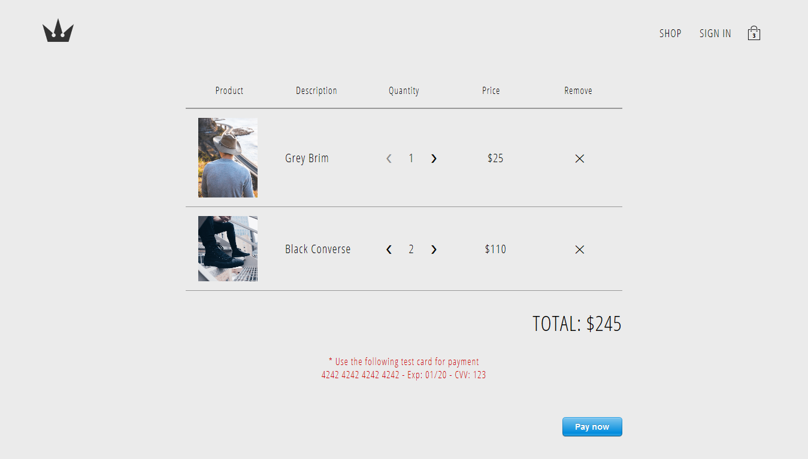
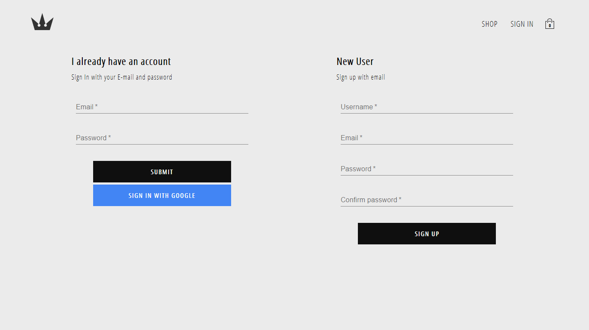

# ClothApp

A sample e-commerce clothing application, built with React, Redux, JavaScript, and CSS.

## Live Demo:

https://cloth-app.herokuapp.com/

## Project Screen Shots

## Installation and Setup Instructions

Clone down this repository. You will need `node` and `npm` installed globally on your machine.  

### Installation

Run either `npm install` or `yarn` in project root directory **and** client folder to build all dependencies.

### Firebase config

Replace the `firebaseConfig` variable in `client/src/utils/firebase.utils.js` with your own config object from the 
firebase dashboard. [Learn more](https://support.google.com/firebase/answer/7015592?hl=en).

### Stripe config

Set the `publishableKey` variable in the `client/src/components/stripe/StripeCheckoutButton` with your own publishable 
key from the stripe dashboard. [Learn More](https://stripe.com/docs/keys).

In the project root directory, create a `.env` file, type `STRIPE_SECRET_KEY=secret_key`, replacing `secret_key` with
 your own Stripe secret key. [Learn More](https://stripe.com/docs/keys).

### Start Server:

`npm dev` or `yarn dev` in project root directory.

To Visit App:

`localhost:3000`

## Languages, Tools & Libraries

### JavaScript

- [ESLint](https://eslint.org) : JavaScript and JSX Linter.
- [React](https://reactjs.org) : Library for building UI.
- [Redux](https://redux.js.org) : Library for managing application state.
- [Node.js](https://nodejs.org) / [Express](https://expressjs.com) : Node.js for server side coding, used with 
express framework.
- [axios](https://github.com/axios/axios) : Promise based HTTP client for the browser and node.js.

### CSS

- [Styled Components](https://www.styled-components.com) : CSS-in-JS library.

### Extra

- [Firebase](https://firebase.google.com/) : Realtime database + users authentication management.
- [Stripe](https://stripe.com/) : Online payment platform.

## Functionality overview

- Sign-up / Sign-in using email or google account.
- Browse items by category.
- Add items to cart.
- Show cart content information (quantity of each article, total price...)
- Checkout items using Stripe with a given test credit card information to use.

## Reflection

This is a 3 week long project following a course built in order to learn React's advanced features and familiarizing 
myself 
with React ecosystem.
I was planning to add many more features I had in mind, but I wasn't able to do so due to time constraints.
I chose to use the `create-react-app` boilerplate to minimize initial setup and invest more time in diving into weird technological rabbit holes.
